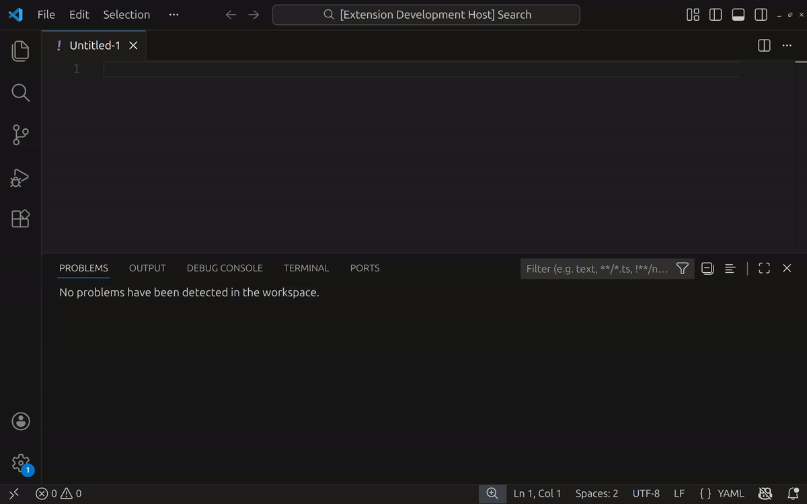

# vscode-yamllint-js

VSCode extension for
[yamllint-js](https://github.com/kimzuni-labs/yamllint-js)

## Installation

[Visual Studio Code Marketplace](https://marketplace.visualstudio.com/items?itemName=kimzuni.vscode-yamllint-js)

## Features

## License

[GPL version 3](LICENSE)
(based on [yamllint-js](https://github.com/kimzuni-labs/yamllint-js))
